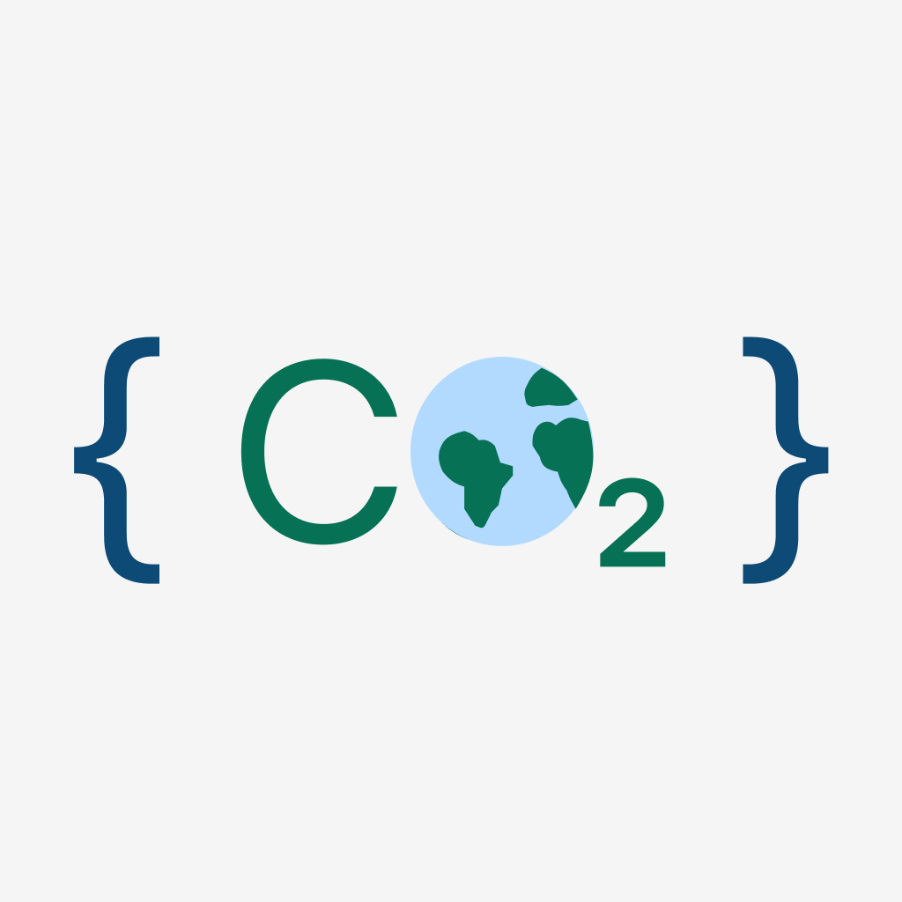
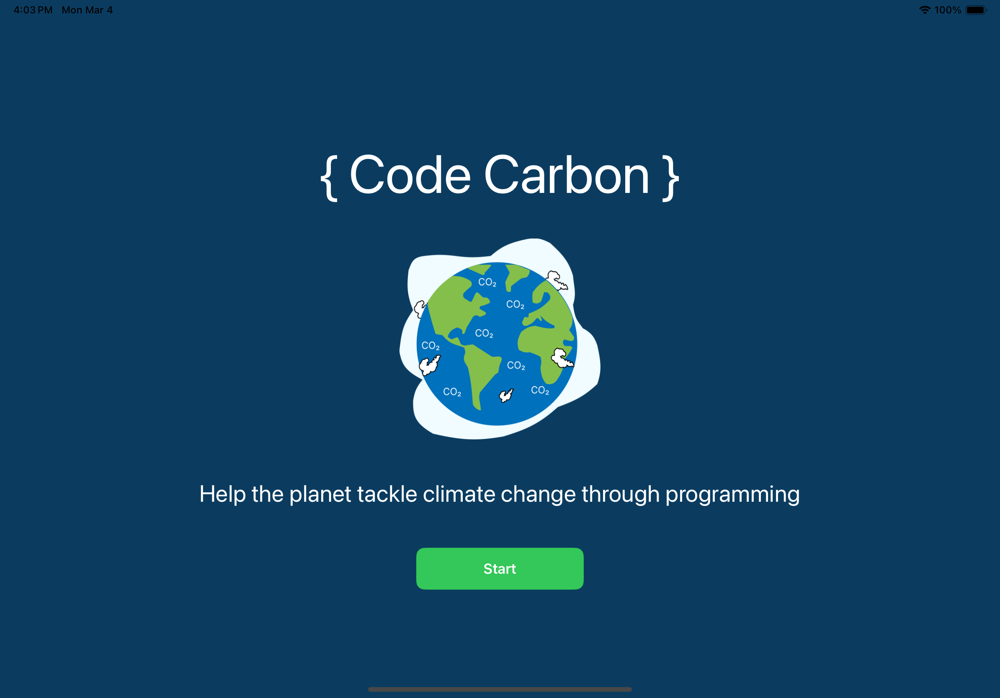
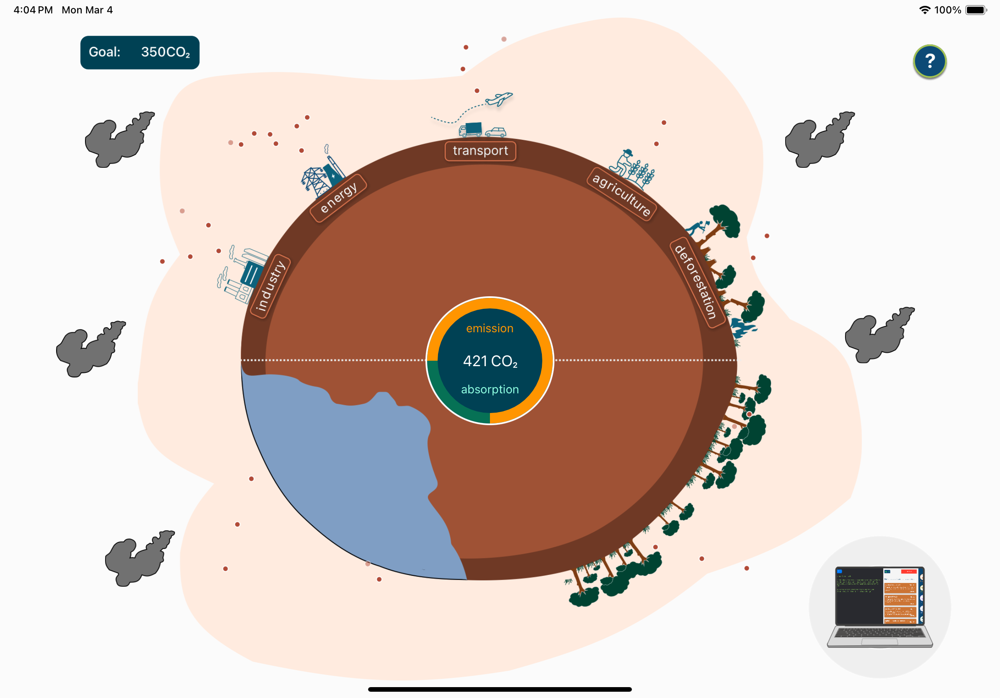
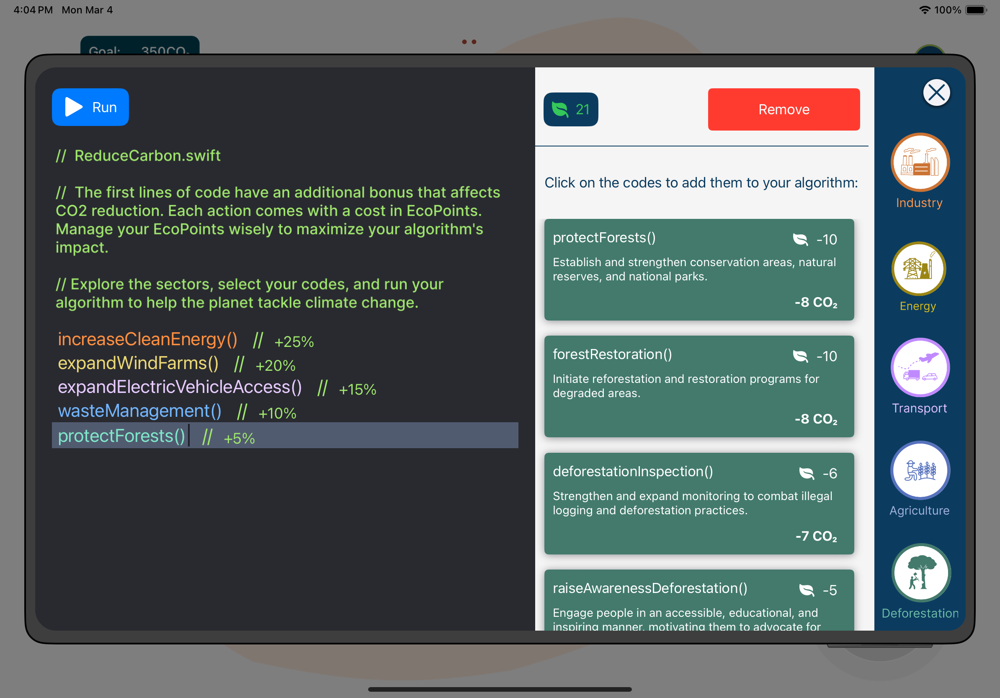
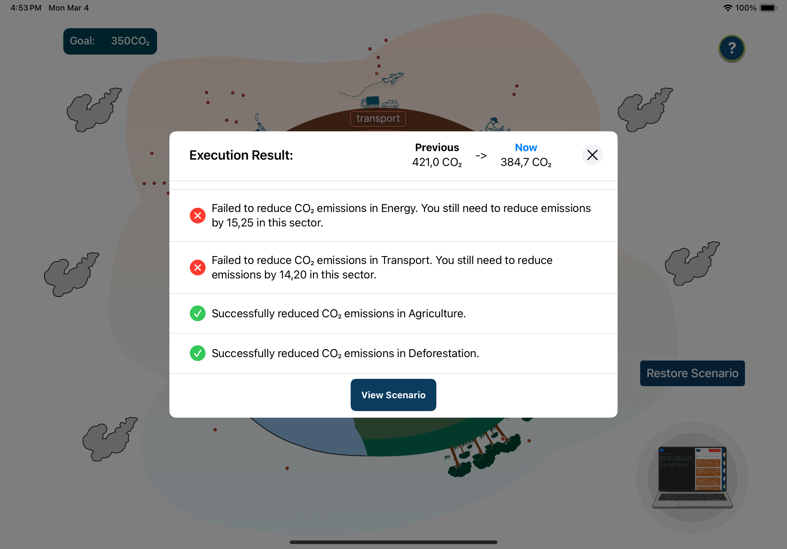
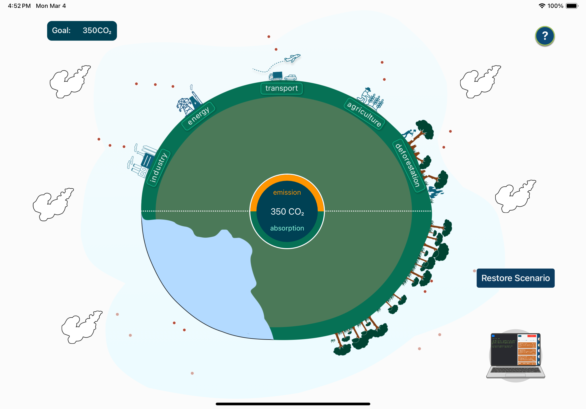

# Swift Student Challenge 2024

# Code Carbon

  
   
   
 <blockquote>
    This project is my submission for the <a href="https://developer.apple.com/swift-student-challenge/">Swift Student Challenge</a> 2024
 </blockquote>

## About

Welcome to Code Carbon, an educational app developed for my Swift Student Challenge 2024 Submission. This app empowers users to create algorithms aimed at addressing environmental issues caused by excessive carbon emissions, leading to climate change. The goal of this application is to bring together the environment and programming.

Programming is a tool for change. It allows us to create impactful solutions that drive real-world environmental progress, making it possible to help both people and the planet. In this app, you can code a better world.

**Used Technologies**: SwiftUI, SpriteKit.

## Supported Platforms

iPadOS 16 or later

## Installation and Usage

Requirements: Swift Playgrounds 4.4, Xcode 15 or later

* Clone the repository.
* Open the `Scolarship.swiftpm` file with Swift Playgrounds or Xcode.
* (Xcode only) Change the Run Destination to your device.
* Run the project.
* Follow the steps in the app.

## Screenshots

  
  
  
  
  

## Features

* Sustainable Action Selection: Click on each sector to change available actions, which are sustainable actions with a CO2 reduction value and an Eco Points cost.
* Eco Points: Use Eco Points as currency for each sustainable action. When you click on an action it is added to your algorithm.
* Impact Bonus: Every line of code you write comes with an additional bonus impact on CO2 reduction.
* Customization: If you need to make changes, you can click on selected codes to remove them or change the order.
* Algorithm Execution: After programming your sustainable algorithm, click the button to execute it. Select codes in all available sectors to succeed.
* Visual Feedback: After execution, you will receive feedback in each sector. The visual feedback of the planet will only change if you achieve the change targets, illustrating the impact of your choices on the scenario.

## Demo Video

  <video src="https://github.com/erickrib/Swift-Student-Challenge2024/assets/88789664/54431345-90d7-4fcc-841a-68d024a690f3" width="290"></video>

